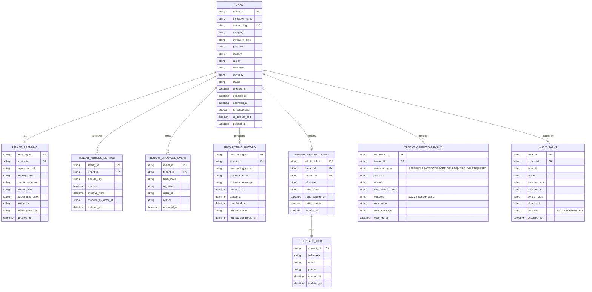

```mermaid
erDiagram
  %% =========================================================
  %% MODULE 1: TENANT & INSTITUTION MANAGEMENT — ER DIAGRAM
  %% =========================================================

  TENANT ||--o| TENANT_BRANDING : has
  TENANT ||--o{ TENANT_MODULE_SETTING : configures
  TENANT ||--o{ TENANT_LIFECYCLE_EVENT : emits
  TENANT ||--o| PROVISIONING_RECORD : provisions
  TENANT ||--o| TENANT_PRIMARY_ADMIN : assigns
  TENANT_PRIMARY_ADMIN ||--|| CONTACT_INFO : uses

  %% Optional: a record of destructive ops (suspend/delete/reset)
  TENANT ||--o{ TENANT_OPERATION_EVENT : records

  %% Optional: audit log stream (can be global, scoped to tenant)
  TENANT ||--o{ AUDIT_EVENT : audited_by

  TENANT {
    string tenant_id PK
    string institution_name
    string tenant_slug UK
    string category
    string institution_type
    string plan_tier
    string country
    string region
    string timezone
    string currency
    string status
    datetime created_at
    datetime updated_at
    datetime activated_at
    boolean is_suspended
    boolean is_deleted_soft
    datetime deleted_at
  }

  TENANT_BRANDING {
    string branding_id PK
    string tenant_id FK
    string logo_asset_ref
    string primary_color
    string secondary_color
    string accent_color
    string background_color
    string text_color
    string theme_pack_key
    datetime updated_at
  }

  TENANT_MODULE_SETTING {
    string setting_id PK
    string tenant_id FK
    string module_key
    boolean enabled
    datetime effective_from
    string changed_by_actor_id
    datetime updated_at
  }

  TENANT_LIFECYCLE_EVENT {
    string event_id PK
    string tenant_id FK
    string from_state
    string to_state
    string actor_id
    string reason
    datetime occurred_at
  }

  PROVISIONING_RECORD {
    string provisioning_id PK
    string tenant_id FK
    string provisioning_status
    string last_error_code
    string last_error_message
    datetime queued_at
    datetime started_at
    datetime completed_at
    string rollback_status
    datetime rollback_completed_at
  }

  TENANT_PRIMARY_ADMIN {
    string admin_link_id PK
    string tenant_id FK
    string contact_id FK
    string role_label
    string invite_status
    datetime invite_queued_at
    datetime invite_sent_at
    datetime updated_at
  }

  CONTACT_INFO {
    string contact_id PK
    string full_name
    string email
    string phone
    datetime created_at
    datetime updated_at
  }

  TENANT_OPERATION_EVENT {
    string op_event_id PK
    string tenant_id FK
    string operation_type  "SUSPEND|REACTIVATE|SOFT_DELETE|HARD_DELETE|RESET"
    string actor_id
    string reason
    string confirmation_token
    string outcome  "SUCCEEDED|FAILED"
    string error_code
    string error_message
    datetime occurred_at
  }

  AUDIT_EVENT {
    string audit_id PK
    string tenant_id FK
    string actor_id
    string action
    string resource_type
    string resource_id
    string before_hash
    string after_hash
    string outcome  "SUCCEEDED|FAILED"
    datetime occurred_at
  }
```