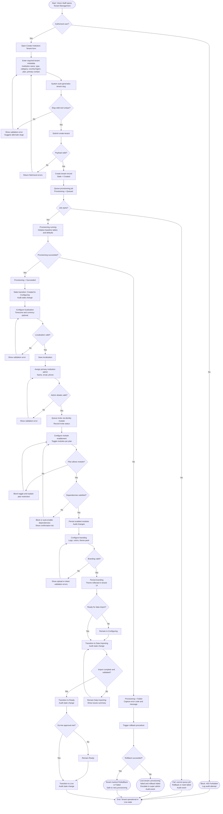

```mermaid
flowchart TD
  A([Start: Vision Staff opens Tenant Management]) --> B{Authorized user?}
  B -- No --> B1([Block: 403 Forbidden<br>Log audit attempt]) --> Z([End])
  B -- Yes --> C[Open Create Institution Tenant form]

  C --> D[Enter required tenant metadata<br>Institution name, type, category, country/region, plan, primary contact]
  D --> E[System auto-generates tenant slug]
  E --> F{Slug valid and unique?}
  F -- No --> F1[Show validation error<br>Suggest alternate slugs] --> D
  F -- Yes --> G[Submit create tenant]

  G --> H{Payload valid?}
  H -- No --> H1[Return field-level errors] --> D
  H -- Yes --> I[Create tenant record<br>State = Created]

  I --> J[Queue provisioning job<br>Provisioning = Queued]
  J --> K{Job starts?}
  K -- No --> K1([Fail: cannot queue job<br>Rollback or mark failed<br>Audit event]) --> Z
  K -- Yes --> L[Provisioning running<br>Initialize baseline tables and defaults]

  L --> M{Provisioning succeeded?}
  M -- No --> N[Provisioning = Failed<br>Capture error code and message]
  N --> O[Trigger rollback procedure]
  O --> P{Rollback succeeded?}
  P -- No --> P1([Lock tenant: provisioning failed and rollback failed<br>Escalate to super admin<br>Audit event]) --> Z
  P -- Yes --> P2([Tenant marked RolledBack or Failed<br>Safe to retry provisioning]) --> Z

  M -- Yes --> Q[Provisioning = Succeeded]
  Q --> R[State transition: Created to Configuring<br>Audit state change]

  R --> S[Configure localization<br>Timezone and currency optional]
  S --> T{Localization valid?}
  T -- No --> T1[Show validation error] --> S
  T -- Yes --> U[Save localization]

  U --> V[Assign primary institution admin<br>Name, email, phone]
  V --> W{Admin details valid?}
  W -- No --> W1[Show validation error] --> V
  W -- Yes --> X[Queue invite via identity module<br>Record invite status]

  X --> Y[Configure module enablement<br>Toggle modules per plan]
  Y --> Y1{Plan allows module?}
  Y1 -- No --> Y2[Block toggle and explain plan restriction] --> Y
  Y1 -- Yes --> Y3{Dependencies satisfied?}
  Y3 -- No --> Y4[Block or auto-enable dependencies<br>Show confirmation list] --> Y
  Y3 -- Yes --> Y5[Persist enabled modules<br>Audit changes]

  Y5 --> AA[Configure branding<br>Logo, colors, theme pack]
  AA --> AB{Branding valid?}
  AB -- No --> AB1[Show upload or token validation errors] --> AA
  AB -- Yes --> AC[Persist branding<br>Theme reflected in tenant UI]

  AC --> AD{Ready for data import?}
  AD -- No --> AD1[Remain in Configuring] --> AE
  AD -- Yes --> AE[Transition to Data Importing<br>Audit state change]

  AE --> AF{Import complete and validated?}
  AF -- No --> AF1[Remain Data Importing<br>Show issues summary] --> AE
  AF -- Yes --> AG[Transition to Ready<br>Audit state change]

  AG --> AH{Go-live approval met?}
  AH -- No --> AH1[Remain Ready] --> AI
  AH -- Yes --> AI[Transition to Live<br>Audit state change]

  AI --> Z([End: Tenant operational in Live state])
```