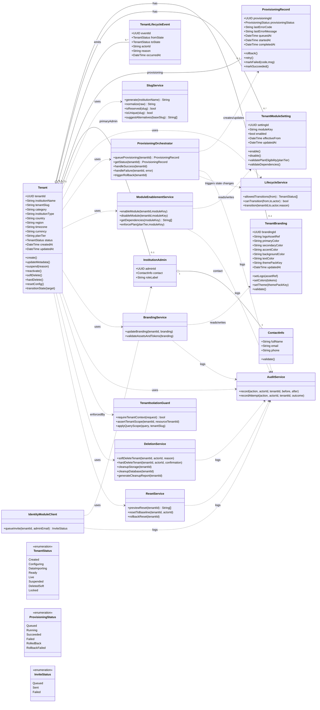

```mermaid
classDiagram
  direction LR

  %% =========================
  %% CORE DOMAIN
  %% =========================
  class Tenant {
    +UUID tenantId
    +String institutionName
    +String tenantSlug
    +String category
    +String institutionType
    +String country
    +String region
    +String timezone
    +String currency
    +String planTier
    +TenantStatus status
    +DateTime createdAt
    +DateTime updatedAt
    +create()
    +updateMetadata()
    +suspend(reason)
    +reactivate()
    +softDelete()
    +hardDelete()
    +resetConfig()
    +transitionState(target)
  }

  class TenantBranding {
    +UUID brandingId
    +String logoAssetRef
    +String primaryColor
    +String secondaryColor
    +String accentColor
    +String backgroundColor
    +String textColor
    +String themePackKey
    +DateTime updatedAt
    +setLogo(assetRef)
    +setColors(tokens)
    +setTheme(themePackKey)
    +validate()
  }

  class TenantModuleSetting {
    +UUID settingId
    +String moduleKey
    +bool enabled
    +DateTime effectiveFrom
    +DateTime updatedAt
    +enable()
    +disable()
    +validatePlanEligibility(planTier)
    +validateDependencies()
  }

  class TenantLifecycleEvent {
    +UUID eventId
    +TenantStatus fromState
    +TenantStatus toState
    +String actorId
    +String reason
    +DateTime occurredAt
  }

  class ProvisioningRecord {
    +UUID provisioningId
    +ProvisioningStatus provisioningStatus
    +String lastErrorCode
    +String lastErrorMessage
    +DateTime queuedAt
    +DateTime startedAt
    +DateTime completedAt
    +rollback()
    +retry()
    +markFailed(code,msg)
    +markSucceeded()
  }

  class ContactInfo {
    +String fullName
    +String email
    +String phone
    +validate()
  }

  class InstitutionAdmin {
    +UUID adminId
    +ContactInfo contact
    +String roleLabel
  }

  %% =========================
  %% SERVICES (DOMAIN LOGIC)
  %% =========================
  class SlugService {
    +generate(institutionName) String
    +normalize(raw) String
    +isReserved(slug) bool
    +isUnique(slug) bool
    +suggestAlternatives(baseSlug) String[]
  }

  class ProvisioningOrchestrator {
    +queueProvisioning(tenantId) ProvisioningRecord
    +getStatus(tenantId) ProvisioningRecord
    +handleSuccess(tenantId)
    +handleFailure(tenantId, error)
    +triggerRollback(tenantId)
  }

  class LifecycleService {
    +allowedTransitions(from) TenantStatus[]
    +canTransition(from,to,actor) bool
    +transition(tenantId,to,actor,reason)
  }

  class ModuleEnablementService {
    +enableModule(tenantId,moduleKey)
    +disableModule(tenantId,moduleKey)
    +getDependencies(moduleKey) String[]
    +enforcePlan(planTier,moduleKey)
  }

  class BrandingService {
    +updateBranding(tenantId, branding)
    +validateAssetsAndTokens(branding)
  }

  class TenantIsolationGuard {
    +requireTenantContext(request) bool
    +assertTenantScope(tenantId, resourceTenantId)
    +applyQueryScope(query, tenantSlug)
  }

  class AuditService {
    +record(action, actorId, tenantId, before, after)
    +recordAttempt(action, actorId, tenantId, outcome)
  }

  class DeletionService {
    +softDeleteTenant(tenantId, actorId, reason)
    +hardDeleteTenant(tenantId, actorId, confirmation)
    +cleanupStorage(tenantId)
    +cleanupDatabase(tenantId)
    +generateCleanupReport(tenantId)
  }

  class ResetService {
    +previewReset(tenantId) String[]
    +resetToBaseline(tenantId, actorId)
    +rollbackReset(tenantId)
  }

  class IdentityModuleClient {
    +queueInvite(tenantId, adminEmail) InviteStatus
  }

  %% =========================
  %% ENUMS / TYPES
  %% =========================
  class TenantStatus {
    <<enumeration>>
    Created
    Configuring
    DataImporting
    Ready
    Live
    Suspended
    DeletedSoft
    Locked
  }

  class ProvisioningStatus {
    <<enumeration>>
    Queued
    Running
    Succeeded
    Failed
    RolledBack
    RollbackFailed
  }

  class InviteStatus {
    <<enumeration>>
    Queued
    Sent
    Failed
  }

  %% =========================
  %% RELATIONSHIPS
  %% =========================
  Tenant "1" o-- "0..1" TenantBranding : has
  Tenant "1" o-- "0..*" TenantModuleSetting : has
  Tenant "1" o-- "0..*" TenantLifecycleEvent : emits
  Tenant "1" o-- "0..1" ProvisioningRecord : provisioning
  Tenant "1" o-- "0..1" InstitutionAdmin : primaryAdmin
  InstitutionAdmin "1" o-- "1" ContactInfo : contact

  Tenant ..> SlugService : uses
  Tenant ..> LifecycleService : uses
  Tenant ..> ProvisioningOrchestrator : uses
  Tenant ..> ModuleEnablementService : uses
  Tenant ..> BrandingService : uses
  Tenant ..> AuditService : uses
  Tenant ..> TenantIsolationGuard : enforcedBy
  Tenant ..> DeletionService : uses
  Tenant ..> ResetService : uses

  ProvisioningOrchestrator ..> ProvisioningRecord : creates/updates
  ProvisioningOrchestrator ..> AuditService : logs
  ProvisioningOrchestrator ..> LifecycleService : triggers state changes

  ModuleEnablementService ..> TenantModuleSetting : reads/writes
  ModuleEnablementService ..> AuditService : logs

  BrandingService ..> TenantBranding : reads/writes
  BrandingService ..> AuditService : logs

  DeletionService ..> AuditService : logs
  ResetService ..> AuditService : logs

  IdentityModuleClient ..> InstitutionAdmin : invites
  IdentityModuleClient ..> AuditService : logs
```