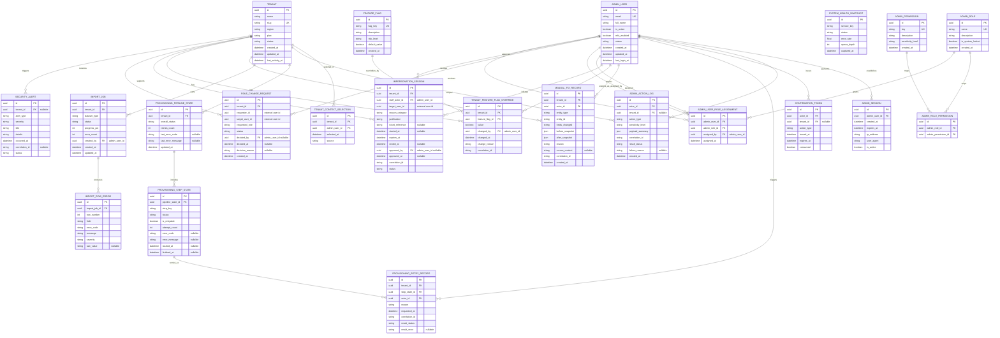

```mermaid
erDiagram
  %% MODULE 2: VISION ADMIN CONSOLE (INTERNAL BACKOFFICE)
  %% ERD focuses on persisted data entities and their relationships.
  %% Types are indicative; implement with Django fields / DB types as needed.

  ADMIN_USER {
    uuid id PK
    string email UK
    string full_name
    boolean is_active
    boolean mfa_enabled
    string status
    datetime created_at
    datetime updated_at
    datetime last_login_at
  }

  ADMIN_SESSION {
    uuid id PK
    uuid admin_user_id FK
    datetime created_at
    datetime expires_at
    string ip_address
    string user_agent
    boolean is_active
  }

  TENANT {
    uuid id PK
    string name
    string slug UK
    string region
    string plan
    string status
    datetime created_at
    datetime updated_at
    datetime last_activity_at
  }

  TENANT_CONTEXT_SELECTION {
    uuid id PK
    uuid tenant_id FK
    uuid admin_user_id FK
    datetime selected_at
    string source
  }

  ADMIN_ACTION_LOG {
    uuid id PK
    uuid actor_id FK
    uuid tenant_id FK "nullable"
    string action_type
    string sensitivity_level
    json payload_summary
    string correlation_id
    string result_status
    string failure_reason "nullable"
    datetime created_at
  }

  CONFIRMATION_TOKEN {
    uuid id PK
    uuid actor_id FK
    uuid tenant_id FK "nullable"
    string action_type
    datetime issued_at
    datetime expires_at
    boolean consumed
  }

  PROVISIONING_PIPELINE_STATE {
    uuid id PK
    uuid tenant_id FK
    string overall_status
    int retries_count
    string last_error_code "nullable"
    string last_error_message "nullable"
    datetime updated_at
  }

  PROVISIONING_STEP_STATE {
    uuid id PK
    uuid pipeline_state_id FK
    string step_key
    string status
    boolean is_retryable
    int attempt_count
    string error_code "nullable"
    string error_message "nullable"
    datetime started_at "nullable"
    datetime finished_at "nullable"
  }

  PROVISIONING_RETRY_RECORD {
    uuid id PK
    uuid tenant_id FK
    uuid step_state_id FK
    uuid actor_id FK
    string reason
    datetime requested_at
    string correlation_id
    string result_status
    string result_error "nullable"
  }

  IMPORT_JOB {
    uuid id PK
    uuid tenant_id FK
    string dataset_type
    string status
    int progress_pct
    int error_count
    uuid created_by FK "admin_user_id"
    datetime created_at
    datetime updated_at
  }

  IMPORT_ROW_ERROR {
    uuid id PK
    uuid import_job_id FK
    int row_number
    string field
    string error_code
    string message
    string severity
    string raw_value "nullable"
  }

  MANUAL_FIX_RECORD {
    uuid id PK
    uuid tenant_id FK
    uuid actor_id FK
    string entity_type
    string entity_id
    string fields_changed
    json before_snapshot
    json after_snapshot
    string reason
    string source_context "nullable"
    string correlation_id
    datetime created_at
  }

  FEATURE_FLAG {
    uuid id PK
    string flag_key UK
    string description
    string risk_level
    boolean default_value
    datetime created_at
  }

  TENANT_FEATURE_FLAG_OVERRIDE {
    uuid id PK
    uuid tenant_id FK
    uuid feature_flag_id FK
    boolean value
    uuid changed_by FK "admin_user_id"
    datetime changed_at
    string change_reason
    string correlation_id
  }

  IMPERSONATION_SESSION {
    uuid id PK
    uuid tenant_id FK
    uuid staff_actor_id FK "admin_user_id"
    uuid target_user_id "external user id"
    string reason_category
    string justification
    string ticket_reference "nullable"
    datetime started_at "nullable"
    datetime expires_at
    datetime ended_at "nullable"
    uuid approved_by FK "admin_user_id nullable"
    datetime approved_at "nullable"
    string correlation_id
    string status
  }

  ROLE_CHANGE_REQUEST {
    uuid id PK
    uuid tenant_id FK
    uuid requester_id "external user id"
    uuid target_user_id "external user id"
    string requested_role
    string status
    uuid decided_by FK "admin_user_id nullable"
    datetime decided_at "nullable"
    string decision_reason "nullable"
    datetime created_at
  }

  SECURITY_ALERT {
    uuid id PK
    uuid tenant_id FK "nullable"
    string alert_type
    string severity
    string title
    string details
    datetime occurred_at
    string correlation_id "nullable"
    string status
  }

  SYSTEM_HEALTH_SNAPSHOT {
    uuid id PK
    string service_key
    string status
    float error_rate
    int queue_depth
    datetime captured_at
  }

  ADMIN_ROLE {
    uuid id PK
    string name UK
    string description
    boolean is_system_locked
    datetime created_at
  }

  ADMIN_PERMISSION {
    uuid id PK
    string key UK
    string description
    string sensitivity_level
    datetime created_at
  }

  ADMIN_ROLE_PERMISSION {
    uuid id PK
    uuid admin_role_id FK
    uuid admin_permission_id FK
  }

  ADMIN_USER_ROLE_ASSIGNMENT {
    uuid id PK
    uuid admin_user_id FK
    uuid admin_role_id FK
    uuid assigned_by FK "admin_user_id"
    datetime assigned_at
  }

  %% Relationships and cardinalities

  ADMIN_USER ||--o{ ADMIN_SESSION : establishes
  ADMIN_USER ||--o{ ADMIN_ACTION_LOG : performs
  ADMIN_USER ||--o{ CONFIRMATION_TOKEN : issues
  ADMIN_USER ||--o{ PROVISIONING_RETRY_RECORD : triggers
  ADMIN_USER ||--o{ MANUAL_FIX_RECORD : applies
  ADMIN_USER ||--o{ TENANT_FEATURE_FLAG_OVERRIDE : changes
  ADMIN_USER ||--o{ IMPERSONATION_SESSION : initiates
  ADMIN_USER ||--o{ ADMIN_USER_ROLE_ASSIGNMENT : assigned
  ADMIN_USER ||--o{ ADMIN_USER_ROLE_ASSIGNMENT : assigns_as_assigned_by
  ADMIN_USER ||--o{ ROLE_CHANGE_REQUEST : decides

  TENANT ||--o{ TENANT_CONTEXT_SELECTION : selected_in
  TENANT ||--o{ ADMIN_ACTION_LOG : scoped
  TENANT ||--o{ PROVISIONING_PIPELINE_STATE : has
  PROVISIONING_PIPELINE_STATE ||--o{ PROVISIONING_STEP_STATE : includes
  PROVISIONING_STEP_STATE ||--o{ PROVISIONING_RETRY_RECORD : retried_as

  TENANT ||--o{ IMPORT_JOB : owns
  IMPORT_JOB ||--o{ IMPORT_ROW_ERROR : produces
  TENANT ||--o{ MANUAL_FIX_RECORD : corrected_by

  FEATURE_FLAG ||--o{ TENANT_FEATURE_FLAG_OVERRIDE : overridden_by
  TENANT ||--o{ TENANT_FEATURE_FLAG_OVERRIDE : has

  TENANT ||--o{ IMPERSONATION_SESSION : supports
  ADMIN_USER o|--o{ IMPERSONATION_SESSION : approves

  TENANT ||--o{ ROLE_CHANGE_REQUEST : receives

  TENANT o|--o{ SECURITY_ALERT : triggers

  ADMIN_ROLE ||--o{ ADMIN_ROLE_PERMISSION : maps
  ADMIN_PERMISSION ||--o{ ADMIN_ROLE_PERMISSION : maps
  ADMIN_USER ||--o{ ADMIN_USER_ROLE_ASSIGNMENT : receives
  ADMIN_ROLE ||--o{ ADMIN_USER_ROLE_ASSIGNMENT : grants
```