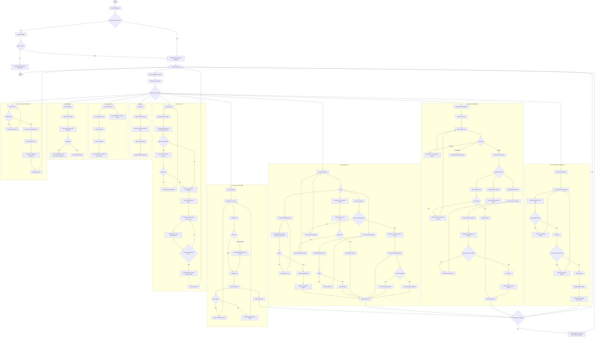

```mermaid
flowchart TD
  %% MODULE 2: VISION ADMIN CONSOLE (INTERNAL BACKOFFICE)
  %% Safe Mermaid syntax: avoid quotes, avoid special punctuation in node text.

  A([Start]) --> B[Vision Staff Login]
  B --> C{MFA required by policy?}
  C -- Yes --> D[MFA Challenge]
  D --> E{MFA success?}
  E -- No --> X1[Access Denied and Log Auth Failure] --> Z([End])
  E -- Yes --> F[Admin Console Session Established]
  C -- No --> F

  F --> G[Global Dashboard]
  G --> H[Search and Filter Tenants]
  H --> I[Select Tenant Context]

  %% MAIN NAV
  I --> J{Choose Console Area}
  J --> K[Tenant Operations]
  J --> L[Provisioning Monitor]
  J --> M[Imports and Remediation]
  J --> N[Feature Flags]
  J --> O[Audit Logs]
  J --> P[Impersonation]
  J --> Q[Security and Alerts]
  J --> R[System Health]
  J --> S[Admin Roles]

  %% TENANT OPS
  subgraph TENANT_OPS [Tenant Operations]
    K --> K1{Action}
    K1 --> K2[Create Tenant Workspace]
    K1 --> K3[Edit Tenant Configuration]
    K1 --> K4[Suspend or Unsuspend Tenant]
    K1 --> K5[Reset Tenant Data]

    K2 --> K2a[Validate Required Fields and Slug Uniqueness]
    K2a --> K2b{Valid?}
    K2b -- No --> K2e[Show Field Errors] --> K2
    K2b -- Yes --> K2c[Create Tenant Record]
    K2c --> K2d[Trigger Provisioning Pipeline]
    K2d --> K6[Write Audit Event]

    K3 --> K3a[Validate Editable Fields]
    K3a --> K3b{Valid?}
    K3b -- No --> K3e[Show Field Errors] --> K3
    K3b -- Yes --> K3c[Save Changes]
    K3c --> K6

    K4 --> K4a[Collect Reason and Confirm]
    K4a --> K4b{Authorized?}
    K4b -- No --> K4e[Block and Audit Attempt] --> K
    K4b -- Yes --> K4c[Apply State Change]
    K4c --> K6

    K5 --> K5a{Super Admin Required?}
    K5a -- No --> K5b[Block and Audit Attempt] --> K
    K5a -- Yes --> K5c[Double Confirm and Typed Phrase]
    K5c --> K5d[Execute Reset to Baseline]
    K5d --> K6
    K5d --> K5e{Reset succeeded?}
    K5e -- No --> K5f[Lock Tenant and Escalate] --> K6
    K5e -- Yes --> K5g[Tenant Ready at Baseline] --> K6
  end

  %% PROVISIONING
  subgraph PROVISIONING [Provisioning Monitor and Retry]
    L --> L1[View Provisioning Timeline]
    L1 --> L2[Inspect Step Errors and Logs]
    L2 --> L3{Retry Eligible Step?}
    L3 -- No --> L4[Show Not Retryable Reason] --> L1
    L3 -- Yes --> L5[Retry Step]
    L5 --> L6{Concurrent Retry Running?}
    L6 -- Yes --> L7[Block and Show In Progress] --> L1
    L6 -- No --> L8[Dispatch Retry]
    L8 --> L9[Update Pipeline State]
    L9 --> L10[Write Audit Event and Retry History]
  end

  %% IMPORTS
  subgraph IMPORTS [Imports and Remediation]
    M --> M1[View Import Jobs]
    M1 --> M2[Select Import Job]
    M2 --> M3{Job Status}
    M3 -- Running --> M4[Read Only View Logs and Progress] --> M2
    M3 -- Failed --> M5[View Row Level Errors]
    M3 -- Succeeded --> M6[View Summary and Outputs]

    M5 --> M7{Remediation Action}
    M7 --> M8[Re Run Import Job]
    M7 --> M9[Apply Manual Data Fix]
    M7 --> M10[Download Error Report]

    M8 --> M8a{Job Running?}
    M8a -- Yes --> M8b[Block Re Run and Show In Progress] --> M2
    M8a -- No --> M8c[Trigger Re Run] --> M11[Write Audit Event]

    M9 --> M9a[Open Manual Fix Drawer]
    M9a --> M9b[Capture Before Snapshot]
    M9b --> M9c[Apply After Changes and Validate]
    M9c --> M9d{Valid and Tenant Scoped?}
    M9d -- No --> M9e[Block and Show Errors] --> M9a
    M9d -- Yes --> M9f[Commit Fix]
    M9f --> M9g[Capture After Snapshot and Diff]
    M9g --> M11

    M10 --> M12[Generate and Download Report]
  end

  %% FEATURE FLAGS
  subgraph FLAGS [Per Tenant Feature Flags]
    N --> N1[View Flags for Tenant]
    N1 --> N2[Select Flag]
    N2 --> N3{Risk Level}
    N3 -- Safe --> N4[Toggle Flag]
    N3 -- Risky or Critical --> N5[Show Warning and Require Confirm]
    N5 --> N4
    N4 --> N6[Persist Override]
    N6 --> N7[Write Audit Event]
    N6 --> N8{Write Failed?}
    N8 -- Yes --> N9[Revert and Notify Failure] --> N1
    N8 -- No --> N10[Show Updated Effective Value] --> N1
  end

  %% AUDIT LOGS
  subgraph AUDIT [Audit Logs]
    O --> O1[View Tenant Audit Logs]
    O1 --> O2[Filter by Date Actor Action Type]
    O2 --> O3[Open Event Details]
    O3 --> O4[Mask Sensitive Payloads]
  end

  %% IMPERSONATION
  subgraph IMPERSONATE [Impersonation]
    P --> P1[Request Impersonation]
    P1 --> P2[Provide Target User and Justification and TTL]
    P2 --> P3{Approval Required?}
    P3 -- Yes --> P4[Route to Super Admin Approver]
    P4 --> P5{Approved?}
    P5 -- No --> P6[Denied and Audit Decision] --> P
    P5 -- Yes --> P7[Start Impersonation Session]
    P3 -- No --> P7

    P7 --> P8[Show Impersonation Banner]
    P8 --> P9[Operate as Target User within Tenant]
    P9 --> P10[Stamp Actions with Correlation ID]
    P10 --> P11{TTL Expired or Manual End?}
    P11 -- Yes --> P12[Terminate Session and Invalidate Token]
    P12 --> P13[Write Audit Event]
    P11 -- No --> P9
  end

  %% SECURITY AND ALERTS
  subgraph SECURITY [Security and Alerts]
    Q --> Q1[View Security Alerts]
    Q1 --> Q2[Filter by Severity]
    Q2 --> Q3[Open Alert Detail]
    Q3 --> Q4[Link to Related Correlation ID and Tenant]
    Q --> Q5[Enforce MFA for Sensitive Actions]
  end

  %% SYSTEM HEALTH
  subgraph HEALTH [System Health]
    R --> R1[View Service Status]
    R1 --> R2[View Queue Depth and Error Rates]
    R2 --> R3{Degraded?}
    R3 -- Yes --> R4[Show Degraded Banner and Incident Guidance]
    R3 -- No --> R5[Show Normal Status]
  end

  %% ADMIN ROLES
  subgraph ADMIN_ROLES [Admin Roles and Permissions]
    S --> S1{Super Admin?}
    S1 -- No --> S2[Read Only Role View] --> S
    S1 -- Yes --> S3[Create or Edit Admin Roles]
    S3 --> S4[Assign Permissions]
    S4 --> S5[Save and Propagate Immediately]
    S5 --> S6[Write Audit Event]
  end

  %% GLOBAL FAIL CLOSED ON AUDIT FOR SENSITIVE WRITES
  K6 --> Y{Audit Write Succeeded?}
  Y -- No --> Y1[Fail Closed Block Sensitive Write and Show Banner] --> G
  Y -- Yes --> G

  M11 --> Y
  L10 --> Y
  N7 --> Y
  P13 --> G
  S6 --> G

  %% EXIT
  G --> Z([End])
```