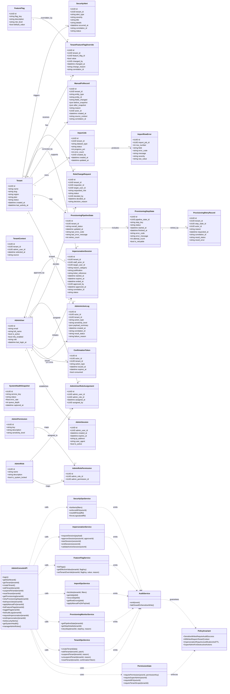

```mermaid
classDiagram
  %% MODULE 2: VISION ADMIN CONSOLE (INTERNAL BACKOFFICE)
  %% High-level domain + service + API surfaces (backend-centric), aligned to the FRD.

  direction LR

  class AdminUser {
    +UUID id
    +string email
    +string full_name
    +bool is_active
    +bool mfa_enabled
    +string role
    +datetime last_login_at
  }

  class AdminSession {
    +UUID id
    +UUID admin_user_id
    +datetime created_at
    +datetime expires_at
    +string ip_address
    +string user_agent
    +bool is_active
  }

  class Tenant {
    +UUID id
    +string name
    +string slug
    +string region
    +string plan
    +string status
    +datetime created_at
    +datetime last_activity_at
  }

  class TenantContext {
    +UUID id
    +UUID tenant_id
    +UUID admin_user_id
    +datetime selected_at
    +string source
  }

  class ProvisioningPipelineState {
    +UUID id
    +UUID tenant_id
    +string overall_status
    +datetime updated_at
    +string last_error_code
    +string last_error_message
    +int retries_count
  }

  class ProvisioningStepState {
    +UUID id
    +UUID pipeline_state_id
    +string step_key
    +string status
    +datetime started_at
    +datetime finished_at
    +string error_code
    +string error_message
    +int attempt_count
    +bool is_retryable
  }

  class ProvisioningRetryRecord {
    +UUID id
    +UUID tenant_id
    +UUID step_state_id
    +UUID actor_id
    +string reason
    +datetime requested_at
    +string correlation_id
    +string result_status
    +string result_error
  }

  class ImportJob {
    +UUID id
    +UUID tenant_id
    +string dataset_type
    +string status
    +int progress_pct
    +int error_count
    +UUID created_by
    +datetime created_at
    +datetime updated_at
  }

  class ImportRowError {
    +UUID id
    +UUID import_job_id
    +int row_number
    +string field
    +string error_code
    +string message
    +string severity
    +string raw_value
  }

  class ManualFixRecord {
    +UUID id
    +UUID tenant_id
    +string entity_type
    +string entity_id
    +string fields_changed
    +json before_snapshot
    +json after_snapshot
    +string reason
    +UUID actor_id
    +datetime created_at
    +string source_context
    +string correlation_id
  }

  class FeatureFlag {
    +UUID id
    +string flag_key
    +string description
    +string risk_level
    +bool default_value
  }

  class TenantFeatureFlagOverride {
    +UUID id
    +UUID tenant_id
    +UUID feature_flag_id
    +bool value
    +UUID changed_by
    +datetime changed_at
    +string change_reason
    +string correlation_id
  }

  class ImpersonationSession {
    +UUID id
    +UUID tenant_id
    +UUID staff_actor_id
    +UUID target_user_id
    +string reason_category
    +string justification
    +string ticket_reference
    +datetime started_at
    +datetime expires_at
    +datetime ended_at
    +UUID approved_by
    +datetime approved_at
    +string correlation_id
    +string status
  }

  class RoleChangeRequest {
    +UUID id
    +UUID tenant_id
    +UUID requester_id
    +UUID target_user_id
    +string requested_role
    +string status
    +UUID decided_by
    +datetime decided_at
    +string decision_reason
  }

  class SecurityAlert {
    +UUID id
    +UUID tenant_id
    +string alert_type
    +string severity
    +string title
    +string details
    +datetime occurred_at
    +string correlation_id
    +string status
  }

  class SystemHealthSnapshot {
    +UUID id
    +string service_key
    +string status
    +float error_rate
    +int queue_depth
    +datetime captured_at
  }

  class AdminRole {
    +UUID id
    +string name
    +string description
    +bool is_system_locked
  }

  class AdminPermission {
    +UUID id
    +string key
    +string description
    +string sensitivity_level
  }

  class AdminRolePermission {
    +UUID id
    +UUID admin_role_id
    +UUID admin_permission_id
  }

  class AdminUserRoleAssignment {
    +UUID id
    +UUID admin_user_id
    +UUID admin_role_id
    +datetime assigned_at
    +UUID assigned_by
  }

  class AdminActionLog {
    +UUID id
    +UUID actor_id
    +UUID tenant_id
    +string action_type
    +string sensitivity_level
    +json payload_summary
    +datetime created_at
    +string correlation_id
    +string result_status
    +string failure_reason
  }

  class ConfirmationToken {
    +UUID id
    +UUID actor_id
    +UUID tenant_id
    +string action_type
    +datetime issued_at
    +datetime expires_at
    +bool consumed
  }

  %% Services (orchestrators / domain services)
  class TenantOpsService {
    +createTenant(data)
    +editTenant(tenantId, patch)
    +suspendTenant(tenantId, reason)
    +unsuspendTenant(tenantId, reason)
    +resetTenant(tenantId, confirmationToken)
  }

  class ProvisioningMonitorService {
    +getPipelineState(tenantId)
    +getStepDetails(tenantId)
    +retryStep(tenantId, stepKey, reason)
  }

  class ImportOpsService {
    +listJobs(tenantId, filters)
    +getJob(jobId)
    +rerunJob(jobId)
    +getRowErrors(jobId)
    +applyManualFix(fixPayload)
  }

  class FeatureFlagService {
    +listFlags()
    +getEffectiveValue(tenantId, flagKey)
    +setTenantOverride(tenantId, flagKey, value, reason)
  }

  class ImpersonationService {
    +requestSession(payload)
    +approveSession(sessionId, approverId)
    +startSession(sessionId)
    +endSession(sessionId)
    +validateActiveSession(actorId)
  }

  class SecurityOpsService {
    +listAlerts(filters)
    +enforceMFA(actorId)
    +resetMFA(staffId)
    +forceLogout(staffId)
  }

  class AuditService {
    +emit(event)
    +failClosedOnSensitiveWrite()
  }

  class PermissionGate {
    +requirePermission(actorId, permissionKey)
    +requireSuperAdmin(actorId)
    +requireMFA(actorId)
    +requireTenantScope(tenantId)
  }

  %% API Controllers (DRF views / endpoints)
  class AdminConsoleAPI {
    +login()
    +getDashboard()
    +getTenant(tenantId)
    +createTenant()
    +editTenant(tenantId)
    +suspendTenant(tenantId)
    +resetTenant(tenantId)
    +getProvisioning(tenantId)
    +retryProvisioningStep(tenantId)
    +listImportJobs(tenantId)
    +applyManualFix(tenantId)
    +listFeatureFlags(tenantId)
    +toggleFlag(tenantId)
    +listAuditLogs(tenantId)
    +requestImpersonation(tenantId)
    +endImpersonation(tenantId)
    +listSecurityAlerts()
    +getSystemHealth()
    +manageAdminRoles()
  }

  %% Relationships
  AdminUser "1" --> "0..*" AdminSession : establishes
  AdminUser "1" --> "0..*" AdminActionLog : performs
  AdminUser "1" --> "0..*" ConfirmationToken : issues

  Tenant "1" --> "0..*" AdminActionLog : scoped
  Tenant "1" --> "0..*" ProvisioningPipelineState : has
  ProvisioningPipelineState "1" --> "1..*" ProvisioningStepState : includes
  ProvisioningStepState "1" --> "0..*" ProvisioningRetryRecord : retried_by

  Tenant "1" --> "0..*" ImportJob : owns
  ImportJob "1" --> "0..*" ImportRowError : produces
  Tenant "1" --> "0..*" ManualFixRecord : corrected_by

  FeatureFlag "1" --> "0..*" TenantFeatureFlagOverride : overridden_by
  Tenant "1" --> "0..*" TenantFeatureFlagOverride : has

  Tenant "1" --> "0..*" ImpersonationSession : supports
  AdminUser "1" --> "0..*" ImpersonationSession : initiates
  ImpersonationSession "0..1" --> "1" AdminUser : approved_by

  Tenant "1" --> "0..*" RoleChangeRequest : receives
  AdminUser "0..1" --> "0..*" RoleChangeRequest : decides

  Tenant "0..1" --> "0..*" SecurityAlert : triggers

  AdminRole "1" --> "0..*" AdminRolePermission : maps
  AdminPermission "1" --> "0..*" AdminRolePermission : maps
  AdminUser "1" --> "0..*" AdminUserRoleAssignment : assigned
  AdminRole "1" --> "0..*" AdminUserRoleAssignment : assigned_to

  %% Service dependencies
  AdminConsoleAPI ..> PermissionGate : uses
  AdminConsoleAPI ..> AuditService : uses
  AdminConsoleAPI ..> TenantOpsService : calls
  AdminConsoleAPI ..> ProvisioningMonitorService : calls
  AdminConsoleAPI ..> ImportOpsService : calls
  AdminConsoleAPI ..> FeatureFlagService : calls
  AdminConsoleAPI ..> ImpersonationService : calls
  AdminConsoleAPI ..> SecurityOpsService : calls

  TenantOpsService ..> AuditService : emits
  ProvisioningMonitorService ..> AuditService : emits
  ImportOpsService ..> AuditService : emits
  FeatureFlagService ..> AuditService : emits
  ImpersonationService ..> AuditService : emits
  SecurityOpsService ..> AuditService : emits

  %% Key policy invariant as a note-like class (Mermaid classDiagram limitation)
  class PolicyInvariant {
    +SensitiveWritesRequireAuditSuccess
    +AllWritesRequireTenantContext
    +ImpersonationRequiresJustificationAndTTL
    +SuperAdminForDestructiveActions
  }

  PermissionGate ..> PolicyInvariant : enforces
  AuditService ..> PolicyInvariant : guarantees
```